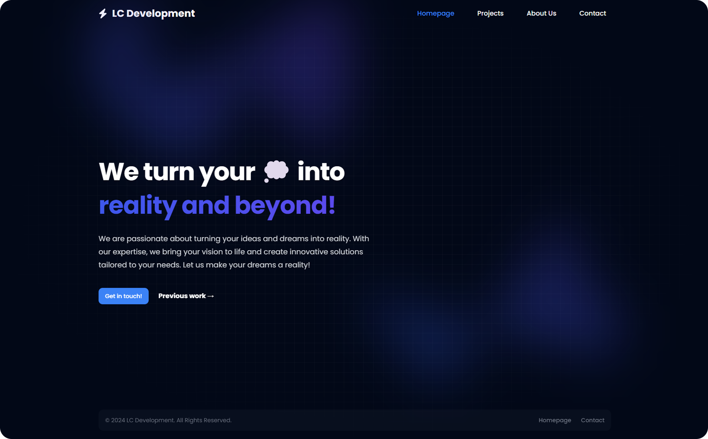
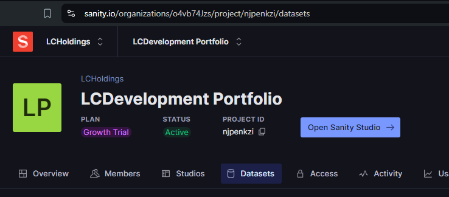
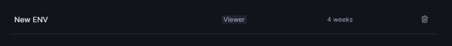
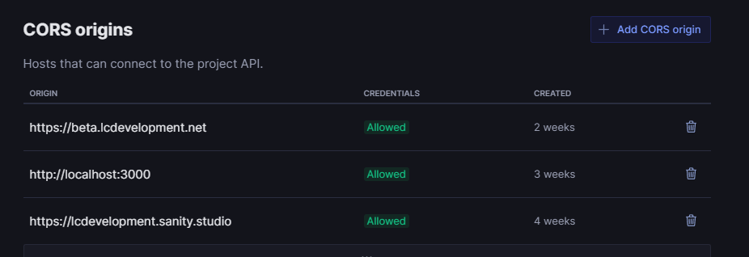

<a id="readme-top"></a>
[![Contributors][contributors-shield]][contributors-url]
[![Forks][forks-shield]][forks-url]
[![Stargazers][stars-shield]][stars-url]
[![Issues][issues-shield]][issues-url]
[![MIT License][license-shield]][license-url]


<!-- PROJECT LOGO -->
<br />
<div align="center">
  <a href="https://github.com/lcholdings/lcdevelopment-portfolio">
    
  </a>

  <h3 align="center">LC Development</h3>

  <p align="center">
    Portfolio made using NuxtJS, TailwindCSS and Sanity CMS.
    <br />
    <a href="https://lcdevelopment.net">Visit Website</a>
    ·
    <a href="https://github.com/LCHoldings/LCDevelopment-Portfolio/issues/new?labels=bug&template=bug-report---.md">Report Bug</a>
    ·
    <a href="https://github.com/LCHoldings/LCDevelopment-Portfolio/fork">Fork Project</a>
  </p>
</div>


<!-- ABOUT THE PROJECT -->
## About The Project

[](https://lcdevelopment.net)

I made this project during [Hack Club Arcade](https://hackclub.com/arcade/) to learn more about how to use a content management system, such as [Sanity CMS](https://www.sanity.io/) together with tools I'm already familiar with, which in this case is [NuxtJS](https://nuxt.cpm/) and [TailwindCSS](https://tailwindcss.com/). I also wanted to create a portfolio of my own for my development group, [LC Development](https://lcdevelopment.net). So win win on my end!

This is going to be updated and continued to be worked on since it will remain as our main portfolio for the group. If you have any suggestions or improvements, feel free to open an issue or fork the project and create a pull request. Thanks!

Some stuff in here will be quite quirky, so don't be surprised if you see some weird stuff in the code. I'm still learning and I'm trying to improve as much as I can. This is only like my third project or something using Vue/Nuxt. Thanks for understanding!

<p align="right">(<a href="#readme-top">back to top</a>)</p>


### Made using

This section contains some of the most notable tools/libraries used in this project.

* [](https://nuxt.com)
* [](https://tailwindcss.com)
* []()
* [](https://sanity.io)


<p align="right">(<a href="#readme-top">back to top</a>)</p>


<!-- GETTING STARTED -->
## Getting Started

How to run this project locally.

### Prerequisites

* Create an project on [Sanity](https://www.sanity.io/) and get the project ID and dataset name. You can find theese on the project dashboard. The Dataset will be under `Dataset` in the navigation bar.
    

* Proceed to creating your read API token which will be used by the website to get data. You can do this by going to `API` in the navigation bar and then `Add API Token` under the `Tokens` section. Give it a name and select `Viewer` under permissions. Save the token for the next step.
    

* IMPORTANT! Do not forget to add `http://localhost:3000` to CORS Origins on the same API page. This is necessary for the website to fetch data from the Sanity API correctly. (Only localhost:3000 is necessary for development)
    


### Installation

_Below is an example of how you can instruct your audience on installing and setting up your app. This template doesn't rely on any external dependencies or services._


1. First of all, run the following command in both the `app` and `studio` folder to install the necessary  dependencies.
    ```sh
    npm install
    ```
2. Fill out the fields `studio/.env` with your own project ID, dataset name and studio URL. (http://localhost:3333)
   ```cs
    SANITY_STUDIO_PROJECT_ID="XXXXXXX"
    SANITY_STUDIO_DATASET="production"
    SANITY_STUDIO_PREVIEW_URL="http://localhost:3333"
   ```
3. Copy `app/.env.example` to `app/.env` and fill out the fields with your own project ID, dataset name and read API token.
   ```cs
    # Optional - The URL of your Sanity Studio
    NUXT_SANITY_STUDIO_URL="http://localhost:3333"

    # Required - The ID of your Sanity project
    NUXT_SANITY_PROJECT_ID="XXXXXXXX"
    # Required - The dataset of your Sanity project
    NUXT_SANITY_DATASET="production"
    # Required - The generated read token, used to fetch data on the server.
    NUXT_SANITY_API_READ_TOKEN="XXXXXXXX"
    ```
4. Run the following command in the `studio` folder to deploy the Sanity Studio.
    ```sh
    npm run deploy
    ```
    It will give you a URL to access the studio where you can input dummy information to show on the website.
5. Run the following command in the `app` folder to start the NuxtJS dev server.
    ```sh
    npm run dev
    ```
    **Congrats**! You now have the project running locally. You can access the website on `http://localhost:3000` and the studio on the link you got from the console when doing step 4.

<p align="right">(<a href="#readme-top">back to top</a>)</p>


<!-- ROADMAP -->
## Roadmap

- [X] Release project
- [ ] Full mobile support (responsiveness)
- [ ] Add Changelog
- [ ] Create Development branch
- [ ] Clean up the code
- [ ] Dark Mode/Light mode
- [ ] Improve the project post page
- [ ] Multi-language Support
    - [ ] Swedish
    - [ ] English

<p align="right">(<a href="#readme-top">back to top</a>)</p>


<!-- CONTRIBUTING -->
## Contributing

Contributions are what make the open source community such an amazing place to learn, inspire, and create. Any contributions you make are **greatly appreciated**.

If you have a suggestion that would make the portfolio better, please fork the repo and create a pull request. You can also simply open an issue with the tag "enhancement".
Don't forget to give the project a star! Thanks!

1. Fork the Project
2. Change the project and add your files or changes (`git add *`)
3. Commit your Changes (`git commit -m 'Feat | Added XXXX to the XXX'`)
4. Push to the Branch (`git push`)
5. Open a Pull Request

### Top contributors:

<a href="https://github.com/LCHoldings/LCDevelopment-Portfolio/graphs/contributors">
  
</a>

<p align="right">(<a href="#readme-top">back to top</a>)</p>


<!-- CONTACT -->
## Contact

Lazyllama - [@Lazyllamaa](https://discord.com/users/754965470888722484) - llama@lcholdings.net

Project Link: [https://github.com/lcholdings/lcdevelopment-portfolio](https://github.com/lcholdings/lcdevelopment-portfolio)

<p align="right">(<a href="#readme-top">back to top</a>)</p>


<!-- ACKNOWLEDGMENTS -->
## Acknowledgments

Thanks to the following people for their help and inspiration:

* [Readme Template](https://github.com/othneildrew/Best-README-Template)
* [Grid/Dot Background Pattern](https://ibelick.com/blog/create-grid-and-dot-backgrounds-with-css-tailwind-css)

<p align="right">(<a href="#readme-top">back to top</a>)</p>


<!-- MARKDOWN LINKS & IMAGES -->
<!-- https://www.markdownguide.org/basic-syntax/#reference-style-links -->
[contributors-shield]: https://img.shields.io/github/contributors/lcholdings/lcdevelopment-portfolio.svg?style=for-the-badge
[contributors-url]: https://github.com/lcholdings/lcdevelopment-portfolio/graphs/contributors
[forks-shield]: https://img.shields.io/github/forks/lcholdings/lcdevelopment-portfolio.svg?style=for-the-badge
[forks-url]: https://github.com/lcholdings/lcdevelopment-portfolio/network/members
[stars-shield]: https://img.shields.io/github/stars/lcholdings/lcdevelopment-portfolio.svg?style=for-the-badge
[stars-url]: https://github.com/lcholdings/lcdevelopment-portfolio/stargazers
[issues-shield]: https://img.shields.io/github/issues/lcholdings/lcdevelopment-portfolio.svg?style=for-the-badge
[issues-url]: https://github.com/lcholdings/lcdevelopment-portfolio/issues
[license-shield]: https://img.shields.io/github/license/lcholdings/lcdevelopment-portfolio.svg?style=for-the-badge
[license-url]: https://github.com/lcholdings/lcdevelopment-portfolio/blob/master/LICENSE.md